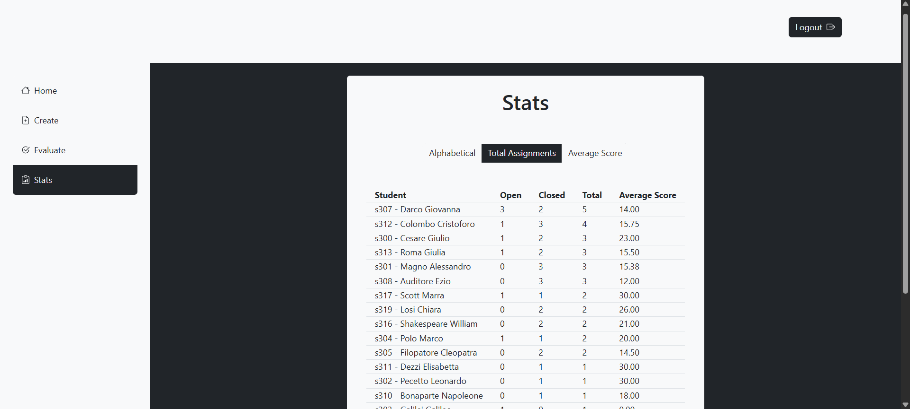

# University Assignment Manager


An interactive web application designed to streamline the workflow between teachers and students. It allows instructors to assign tasks (individual or group-based), track submissions, and grade work, while providing students with a dashboard to manage their pending assignments and view performance statistics. 

Developed as a final project for the **Web Applications I** course at **Politecnico di Torino** (2025).



## 🚀 Features

### For Teachers
* **Assignment Creation:** Create open-ended questions and assign them to specific students.
* **Group Logic:** Advanced validation prevents assigning students to conflicting groups if they already share a significant workload.
* **Evaluation Dashboard:** View pending submissions and assign grades.
* **Analytics:** Track student performance with weighted averages based on group size and individual contributions.

### For Students
* **Task Management:** View and filter "Open" vs "Closed" assignments.
* **Submission System:** Submit answers directly through the application.
* **Performance Tracking:** View personal statistics and grade history.

## 🛠 Tech Stack

**Frontend:**
*  **React.js** (Vite, Functional Components, Hooks)
*  **React-Bootstrap** (Responsive UI)
*  **React Router** (Navigation)

**Backend:**
*   **Node.js** & **Express**
*  **Passport.js** (Authentication with Strategy Local & Crypto Scrypt)
*  **SQLite** (Relational Database)


## 📦 Installation & Setup

To run this project locally, follow these steps:

1.  **Clone the repository**
    ```bash
    git clone https://github.com/lucaragaglia/university-assignment-manager.git
    cd university-assignment-manager
    ```

2.  **Server Setup**
    Navigate to the server folder, install dependencies, and start the backend.
    ```bash
    cd server
    npm install
    node index.mjs
    ```
    *The server will run on http://localhost:3001*

3.  **Client Setup**
    Open a new terminal, navigate to the client folder, and start the frontend.
    ```bash
    cd client
    npm install
    npm run dev
    ```
    *The client will run on http://localhost:5173*

## 🔑 Demo Credentials

You can use the following pre-configured accounts to test the application roles:

| Role | Username (ID) | Password |
| :--- | :--- | :--- |
| **Teacher** | `t400` | `psw` |
| **Teacher** | `t401` | `psw` |
| **Student** | `s301` | `psw` |
| **Student** | `s302` | `psw` |

*(Additional students available from s301 to s320)*

## 🗄 Database Structure

The project uses a **SQLite** database with the following relationships:
* **USERS:** Stores both Students and Teachers (distinguished by Role).
* **ASSIGNMENTS:** Contains the questions, answers, scores, and status.
* **GROUPS:** Manages the many-to-many relationship between Students and Assignments.

---
*Developed by Luca Ragaglia*